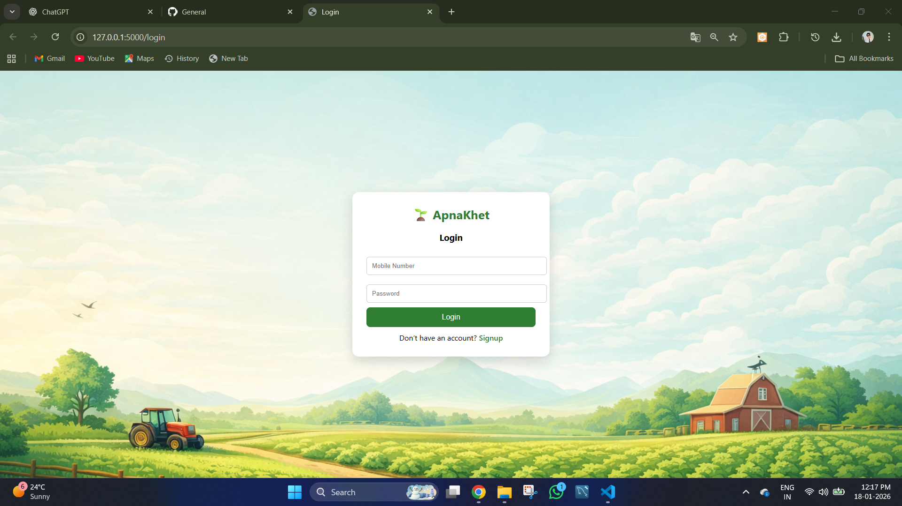
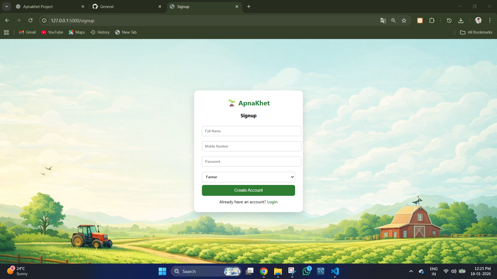
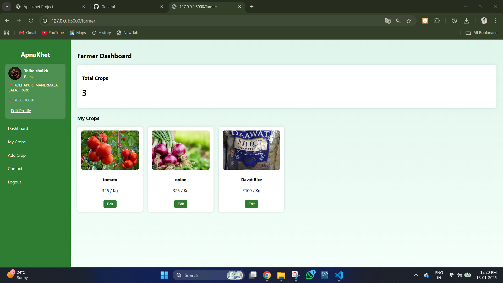
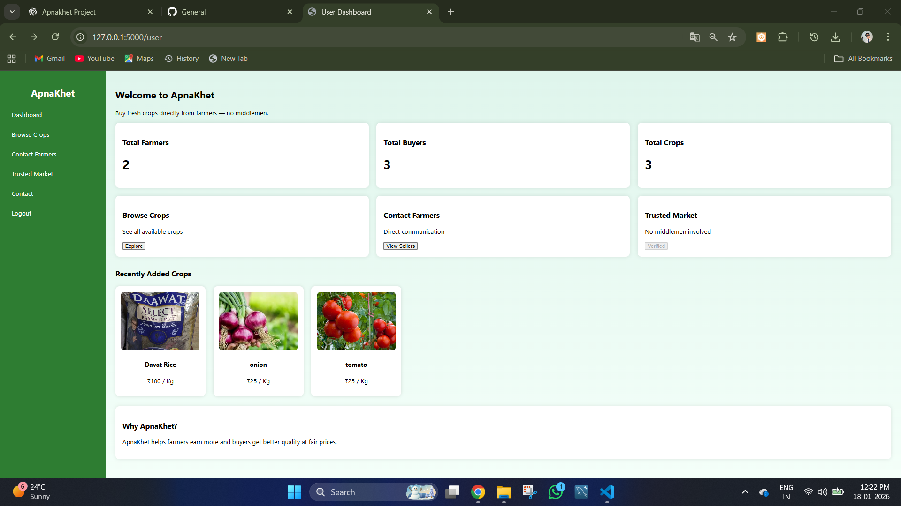
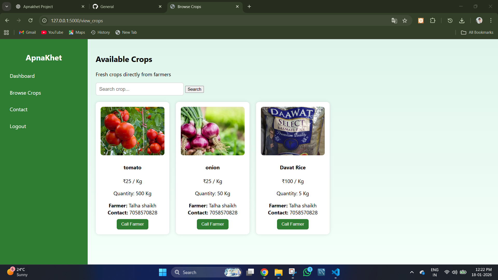
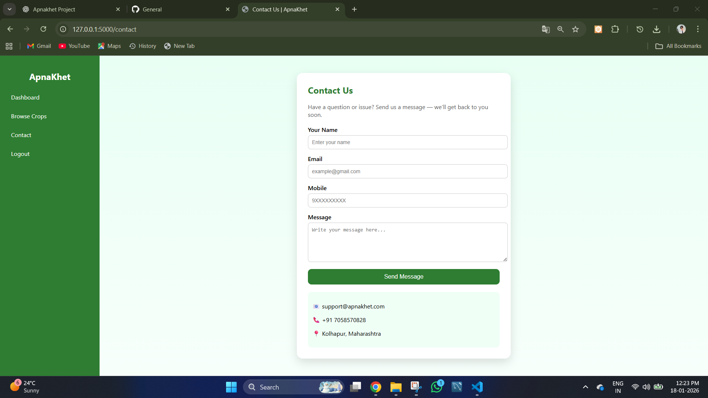

# 🌾 ApnaKhet — Farmer Marketplace Platform  

**ApnaKhet** is a Flask-based web application that connects farmers directly with buyers, eliminating middlemen and ensuring fair pricing for agricultural produce.

This project was built as a full-stack web application using **Python (Flask) + MySQL + HTML/CSS** with role-based authentication and an admin panel.

---

## 🚀 Features  

### 👨‍🌾 Farmer Features  
- Create account with OTP verification  
- Login securely  
- Add crops with images & videos  
- View, edit, and delete crops  
- Personal profile (photo, address, phone)  
- Farmer dashboard with statistics  

### 🛒 Buyer (User) Features  
- Browse available crops  
- Search crops by name  
- View farmer contact details  
- Call farmer directly  
- View live marketplace statistics  

### 🧑‍💼 Admin Features  
- Admin dashboard  
- Manage users (view, search, delete)  
- Manage crops (view, delete)  
- Monitor platform activity  

### 📩 Contact System  
- Users can send messages directly to admin via Gmail SMTP  

---

## 🛠️ Tech Stack  

- **Backend:** Python Flask  
- **Database:** MySQL  
- **Frontend:** HTML, CSS  
- **Email:** Gmail SMTP  
- **IDE:** VS Code  

---

## 📁 Project Structure  

ApnaKhet/
│── app.py
│── templates/
│ ├── login.html
│ ├── signup.html
│ ├── verify_otp.html
│ ├── farmer.html
│ ├── user.html
│ ├── view_crops.html
│ ├── contact.html
│ └── admin.html
│
│── static/
│ ├── dashboard.css
│ ├── contact.css
│ └── uploads/
│
│── screenshots/

## 📷 Screenshots  

### Login Page  

### Signup Page  

### Farmer Dashboard  

### User Dashboard  

### Browse Crops  

### Contact Page  

